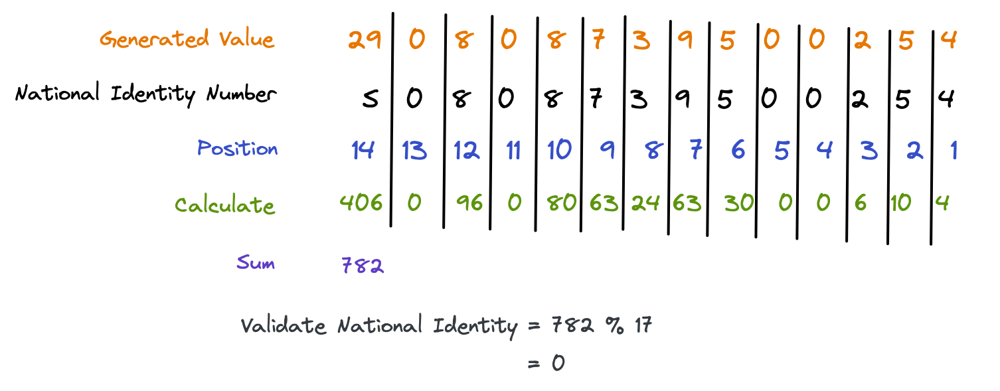

### NATIONAL IDENTITY NUMBER VALIDATOR
This Module validate the NIN of a user by doing a mathematical operation.

The Operation is as follows:

### Instruction

- To install the package simply execute:

    `npm install national-identity-validator`

- Then in your file import the module:

    `import validateNationalIdentityNumber from 'national-identity-validator';`

    `validateNationalIdentityNumber('string');` // return boolean value true or false

### Issues about type

- Simply add type in your package.json file

    "type": "module",